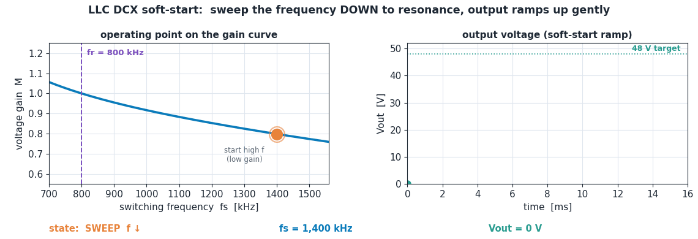
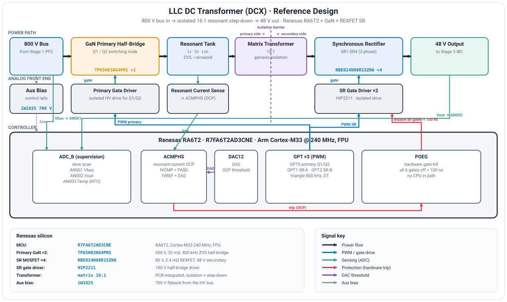
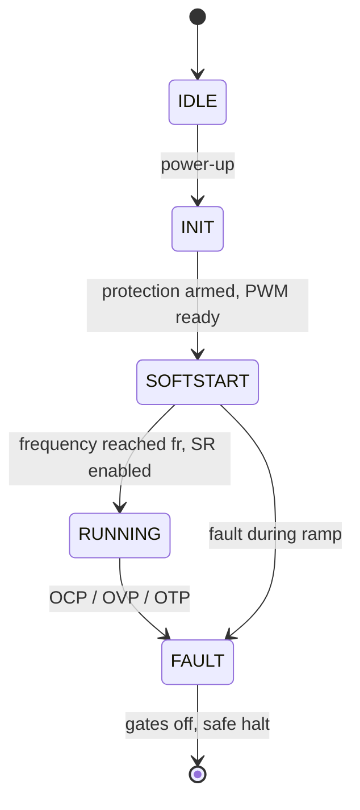

# Stage 2 - LLC DC Transformer (`ra6t2-llc-dcx-fw`)

**An open-loop LLC resonant converter run as a DC transformer (DCX): a fixed 16:1 step-down from the 800 V bus to 48 V, at up to ~98% efficiency. Firmware for the Renesas RA6T2, where the resonant PWM is hardware-autonomous and the only dynamic behavior is a soft-start frequency sweep.**


> **Part of the [AI Datacenter PSU reference design](https://github.com/Naveens-Lab/renesas-ai-datacenter-psu), Stage 2 of 2.** This stage is the isolated DC/DC that follows the [Vienna PFC front end](https://github.com/Naveens-Lab/ra6t2-vienna-pfc-fw). Stage 1 makes the regulated 800 V bus; this stage transforms it down to 48 V.

Read top to bottom: the concept first, then the silicon, then the hardware, then the firmware. The one animation that matters is the [soft-start sweep](#3-the-core-idea-the-soft-start-frequency-sweep), because for an open-loop DCX that sweep is the entire dynamic story.

---

## Contents

1. [What this stage does](#1-what-this-stage-does)
2. [The concept, from zero](#2-the-concept-from-zero)
3. [The core idea: the soft-start frequency sweep](#3-the-core-idea-the-soft-start-frequency-sweep)
4. [Why GaN here](#4-why-gan-here)
5. [The reference design (the hardware)](#5-the-reference-design-the-hardware)
6. [Firmware design](#6-firmware-design)
7. [Project structure](#7-project-structure)
8. [Build and bring-up](#8-build-and-bring-up)
9. [Status and roadmap](#9-status-and-roadmap)
10. [References](#references)

---

## 1. What this stage does

Stage 1 hands over a regulated 800 V DC bus. The job here is to step that down to the 48 V rail the rest of the rack runs on, with galvanic isolation, and to do it at the highest efficiency possible. The converter that does this is an **LLC resonant converter operated as a DC transformer (DCX)**.

The key idea: this stage does **not** regulate. Regulation already happened upstream in the PFC front end, which holds the bus at 800 V. So this stage can run at its single most efficient operating point, the resonant frequency, and behave like a fixed-ratio transformer:

> Vout = Vin / n, with n = 16. 800 V in gives 50 V open-circuit, trimmed to the 48 V working rail.

That is a deliberate system-level division of labor: **put the regulation where it belongs (Stage 1) and let the isolated stage run wide open at peak efficiency.** It is  open-loop  no real-time control loop to tune.

---

## 2. The concept, from zero

### 2.1 Why resonant (LLC)

A hard-switched converter turns its transistors on and off while they are blocking voltage and carrying current at the same time, which burns energy on every edge. At 800 kHz that switching loss would be brutal.

An **LLC resonant converter** puts an inductor-capacitor tank (Lr, Cr, plus the transformer magnetizing inductance Lm) between the switches and the transformer. The tank shapes the current into a near-sinusoid and lets the primary switches turn on at zero volts across them (**zero-voltage switching, ZVS**). Almost no energy is lost at the switching instant. That is what makes ~98% efficiency and very high frequency operation possible, and it is also gentle on EMI.

### 2.2 What "DC transformer" means

The LLC has a voltage gain that depends on switching frequency. At exactly the **resonant frequency fr**, the gain is 1 (the tank is transparent) and the output is simply the input divided by the turns ratio, independent of load. Park the converter right at fr and it behaves like a plain transformer with a DC input and a DC output. That is the **DCX** mode: no regulation, just a fixed, efficient ratio.

### 2.3 Why open-loop is the right call

Because Stage 1 regulates the bus, this stage has nothing left to regulate. Running a control loop here would only add loss and complexity and fight the upstream loop. So after startup, the firmware does not run a control loop at all: the timers generate the gate PWM autonomously, and the CPU only supervises and protects. The contrast with Stage 1 (which closes a full loop every PWM cycle) is the point: **knowing when not to close a loop is a design decision, not an omission.**

---

## 3. The core idea: the soft-start frequency sweep

If you simply switched the converter on at fr into a discharged output, you would get a huge inrush current as the tank slams energy into the empty output capacitors. The fix is elegant and is the heart of this firmware.

The LLC gain falls off **above** resonance. So you **start at a high frequency** (well above fr, where the gain is low), then **sweep the frequency down toward fr**. As frequency falls, the gain climbs, and the output voltage ramps up smoothly and under control. By the time the sweep reaches fr, the output has risen to its full value and the converter locks into DCX mode.



*The operating point slides down the gain curve from 1.4 MHz toward fr at 800 kHz; as the gain rises, the output ramps gently to 48 V. After lock, the PWM is hardware-autonomous.*

In this firmware the sweep starts at **1.4 MHz** and walks down to **fr = 800 kHz** over about **16 ms**, in small period steps (one timer-count per step, every ~0.5 ms). It runs once, in a single timer interrupt, and then hands the converter over to free-running resonant operation.

---

## 4. Why GaN here

Stage 1 used GaN for its bidirectional switch. Here the reason is different: **speed and density at 800 kHz**.

To run the resonant tank at 800 kHz with low loss you need a primary device with very low gate charge and output capacitance and very fast, clean switching. That is exactly GaN's strength. With ZVS, the primary GaN turns on at zero volts, so switching loss is near zero, and the high frequency shrinks the magnetics, which is what makes the stage power-dense enough for a rack.

On the secondary, 48 V at high current means the rectifier conduction loss dominates, so the synchronous rectifiers are low-voltage, ultra-low-Rds(on) **REXFET** MOSFETs driven as active rectifiers.

### Silicon used

| Role | Part | Why |
|---|---|---|
| Control MCU | `R7FA6T2AD3CNE` (RA6T2) | Cortex-M33 @ 240 MHz; three GPT channels for the primary and SR PWM, POEG hardware fault path, ACMPHS comparator, ADC_B supervision. GPT clock (PCLKD) at 120 MHz gives 8.33 ns timing resolution. |
| Primary switch | `TP65H030G4PRS` GaN | 650 V, 30 mΩ. Low gate charge and fast switching for 800 kHz ZVS operation. Operates from the split bus so each device blocks about half of 800 V (see note below). |
| Synchronous rectifier | `RBE024N08R1SZN6` REXFET | 80 V, 2.4 mΩ. Ultra-low Rds(on) for the high-current 48 V secondary. |
| SR gate driver | `HIP2211` | 100 V half-bridge driver for the SR pair. |
| Transformer | matrix, 16:1 | PCB-integrated matrix transformer for low leakage and high current handling. |
| Aux bias | `iW1825` | 700 V flyback generating control-side bias from the HV bus. |

> **Primary device voltage note.** A 650 V device cannot stand off the full 800 V bus in a plain half-bridge. This design assumes the resonant primary works from half the split bus (about 400 V per device), the way the published architecture cascades LLC modules across the +/-400 V rails.

---

## 5. The reference design (the hardware)

The power path and the controller connections, with every Renesas part labeled.



Signal flow:

- The **800 V bus** feeds the **GaN primary half-bridge** (Q1/Q2), which drives the **resonant tank** (Lr, Cr, Lm).
- The tank feeds the **16:1 matrix transformer**, providing isolation and the step-down.
- The secondary is rectified by the **synchronous rectifiers** (SR1 to SR4, two phases) into the **48 V output**.
- The MCU generates all the gate PWM (primary plus SR), runs the one-time soft-start sweep, supervises the bus, output, and temperature over the ADC, and arms the hardware overcurrent trip.

---

## 6. Firmware design

The defining feature: **there is no real-time control loop.** After the soft-start sweep, the GPT timers free-run and generate the gate PWM in hardware. The CPU only does slow supervision and fast hardware-backed protection.

### Peripherals (configured in FSP)

| Peripheral | Handle | Role |
|---|---|---|
| GPT0 primary | `g_gpt_primary` | half-bridge gate PWM (Q1/Q2), triangle-symmetric 800 kHz, 6-count (~50 ns) dead-time. Its overflow ISR runs the soft-start sweep. |
| GPT1 SR phase A | `g_gpt_sr_a` | synchronous rectifier pair SR1/SR2, same PWM config. |
| GPT2 SR phase B | `g_gpt_sr_b` | synchronous rectifier pair SR3/SR4. |
| ACMPHS | `g_acmphs0` | overcurrent comparator. IVCMP = AN000 (resonant current), IVREF = DA0, rising edge. |
| DAC12 | `g_dac0` | sets the comparator overcurrent threshold (DA0), internal, no pin. |
| POEG | `g_poeg_a` | hardware gate kill: an ACMPHS trip cuts all six gate outputs with no CPU in the path. |
| ADC_B | `g_adc_b` | slow supervision scan: Vbus, Vout, Temp. |

### Interrupt priority map

| Source | Priority | Role |
|---|---|---|
| POEG event | 1 (highest) | overcurrent trip |
| ACMPHS | 2 | comparator notification / fault latch |
| GPT0 overflow | 3 | soft-start frequency sweep (startup only) |
| ADC scan-end | 4 (lowest) | Vbus / Vout / Temp supervision |

Note the inversion from Stage 1: with no control loop, the highest-priority interrupt is **protection**, not control. The only periodic firmware is the slow sweep at startup and the slow supervision scan.

### How the soft-start sweep works

In triangle PWM mode the switching frequency is set by the timer period register, where `period = GPT_CLK / (2 x f)` with `GPT_CLK = 120 MHz`. So `fr = 800 kHz` is period 75, and the 1.4 MHz start is period 43. The GPT0 overflow ISR increments the period by one count every ~0.5 ms, walking the frequency down from 1.4 MHz to 800 kHz over about 16 ms. On reaching fr, it enables the SR channels and moves the state machine to RUNNING. After that the ISR has nothing left to do.

### Startup state machine



### Pin assignment

| MCU pin | Signal | Peripheral | Role |
|---|---|---|---|
| PB04 / PB05 | GTIOC0A / GTIOC0B | GPT0 | primary half-bridge Q1 / Q2 |
| PB06 / PB07 | GTIOC1A / GTIOC1B | GPT1 | SR phase A: SR1 / SR2 |
| PA08 / PA09 | GTIOC2A / GTIOC2B | GPT2 | SR phase B: SR3 / SR4 |
| PA00 | IVCMP02 | ACMPHS | resonant current, overcurrent input |
| PA01 | AN001 | ADC_B | Vbus sense (800 V divider) |
| PA02 | AN002 | ADC_B | Vout sense (48 V divider) |
| PA03 | AN003 | ADC_B | temperature (NTC) |
| PC14 | CMPOUT | ACMPHS | comparator output, scope/debug only |

PA00 is the comparator input and therefore cannot also be an ADC_B channel (FSP pin conflict), which is why the resonant current is watched by the hardware comparator and the ADC supervises only the bus, output, and temperature.

---

## 7. Project structure

```
src/
├── hal_entry.c                 thin entry: llc_app_init(); for(;;) llc_app_run();
└── app/
    ├── llc_config.h            all tunables: frequencies, periods, thresholds
    ├── llc_state.h             state enum, shared fault flags, ADC result struct
    ├── llc_protection.c / .h   DAC + ACMPHS + POEG arm and fault handlers
    ├── llc_pwm.c / .h          GPT open/start, period (frequency) set, SR enable
    ├── llc_softstart.c / .h    the frequency sweep + GPT0 overflow callback
    ├── llc_supervision.c / .h  ADC scan, OVP / OTP checks
    └── llc_app.c / .h          the state machine, ties the modules together
```

Each FSP callback (`gpt0_primary_callback`, `poeg_a_callback`, `acmphs0_callback`, `adc_b_callback`) keeps its exact name and lives in its owning module.

---

## 8. Build and bring-up

**Toolchain:** Renesas e2 studio with FSP. Open, **Generate Project Content**, build.

**Staged bench bring-up** (gates before power):

1. **Primary PWM.** Verify the Q1/Q2 complementary pair at 800 kHz with correct dead-time on a scope, no power.
2. **Soft-start sweep.** Confirm the primary sweeps from ~1.4 MHz down to 800 kHz over ~16 ms at startup, then the SR channels appear.
3. **Protection.** Confirm an overcurrent trip cuts all six gates through POEG and latches FAULT.
4. **Supervision.** Confirm the ADC scans Vbus, Vout, and Temp and the OVP/OTP checks fire at their thresholds.
5. **Power, low voltage first.** Bring the bus up gradually and confirm the output reaches 48 V at fr with ZVS on the primary.

---

## 9. Status and roadmap

- [x] FSP peripheral configuration locked (3x GPT, POEG, ACMPHS, DAC, ADC_B)
- [x] Open-loop firmware: PWM generation, soft-start sweep, supervision, protection, state machine
- [x] Hardware overcurrent path (comparator to POEG)
- [ ] Confirm primary device blocking voltage / cascaded module structure
- [ ] Bench: real OVP / OTP thresholds from the actual dividers
- [ ] Bench: real OCP threshold (DAC counts) from the shunt and amplifier gain
- [ ] Exact SR phase-lock via a single timer-start register write
- [ ] GPT-triggered ADC at the trough instead of software trigger

---

## References

- Renesas, *Power Architecture Evolution in Data Centers* (white paper, October 2025):
  https://www.renesas.com/en/document/whp/power-architecture-evolution-data-centers
- Hub repo (full system architecture):
  https://github.com/Naveens-Lab/renesas-ai-datacenter-psu
- Stage 1, Vienna PFC front end:
  https://github.com/Naveens-Lab/ra6t2-vienna-pfc-fw

---

*Built by [Naveens-Lab](https://github.com/Naveens-Lab). Open-loop LLC DC-transformer firmware for the Renesas RA6T2: hardware-autonomous resonant PWM with sub-100 ns comparator-driven overcurrent protection.*
